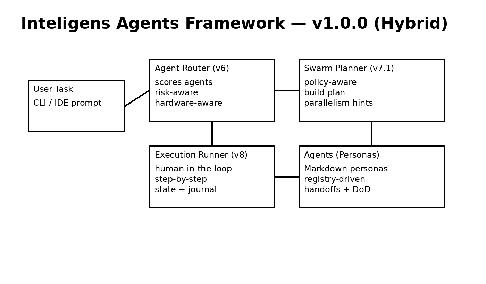

# Inteligens Agents Framework

<p align="center">
  <strong>Agent‑Native Engineering with Human Governance</strong><br/>
  A lightweight orchestration framework for multi‑agent software teams.
</p>

<p align="center">
  
  
  
  
</p>

---

## 🚀 Overview

**Inteligens Agents Framework** is an Agent Operating Framework (AOF) designed to orchestrate specialized AI agents working as a senior engineering team — while keeping humans firmly in control.

It enables:

- 🧠 multi‑agent planning
- 🧭 structured execution flows
- 🛡️ human‑in‑the‑loop governance
- ⚡ IDE‑agnostic operation (Cursor, VSCode, CLI, Antigravity)
- 🏗️ sprint‑aware delivery

> This is **not** a fully autonomous system by design.

---

## 🎯 Design Philosophy

The framework follows three core principles:

### 1. Governed AI
Autonomy without control is a liability.  
Every execution step is observable and reviewable.

### 2. Agent Specialization
Each agent has a clear senior role (PO, Architect, Backend, QA…).

### 3. Incremental Delivery
Work is organized by phases and sprints to ensure real software delivery.

---

## 🏗️ Architecture

<p align="center">
  
</p>

**Flow:**

User → Router → Swarm Planner → Execution Runner → Human Review

---

## ⚡ Quick Start

### 1. Generate a plan

```bash
python .agents/swarm/swarm_planner.py --task "build a RAG pipeline"
```

The plan is saved to `.agents/swarm/execution_plan.json` by default.

### 2. Initialize execution

```bash
python .agents/swarm/execution_runner.py --init
```

Or specify a custom plan path:
```bash
python .agents/swarm/execution_runner.py --init path/to/plan.json
```

### 3. Execute next step

```bash
python .agents/swarm/execution_runner.py --next
```

### 4. Mark step as done

```bash
python .agents/swarm/execution_runner.py --done
```

---

## 🧠 Assisted Auto‑Execution

v1 introduces **assisted auto‑execution**, which provides:

- step‑by‑step execution
- sprint context awareness
- agent‑specific prompts
- execution journal
- human approval loop

This allows high automation **without losing control**.

---

## 📂 Project Structure

```
.agents/
  agents/
  router/
  swarm/
docs/
  manifesto/
  roadmap/
  rfcs/
  guides/
examples/
```

---

## 🧪 Compatibility

The framework is IDE‑agnostic and works with:

- Cursor
- VSCode
- Antigravity
- Claude Code
- Pure CLI

---

## 🛡️ Security Model

The framework intentionally:

- ❌ does NOT auto‑execute code
- ❌ does NOT mutate repositories silently
- ✅ requires human confirmation
- ✅ keeps full execution trace

## Human-in-the-Loop Safety

The framework supports optional approval gates between critical steps.

See:
docs/architecture/APPROVAL_GATES.md

---

## 🗺️ Roadmap

### ✅ v1.0 — Assisted Auto-Execution (Current)

- Agent Router (intent → specialist)
- Swarm Planner (multi-agent plan generation)
- Execution Runner (step-by-step assisted flow)
- Sprint-aware execution context
- Human-in-the-loop by design
- IDE-agnostic operation
- Approval Gates (human checkpoints between phases)

---

### 🟡 v1.1 — Governance Hardening (Planned)

Focus: production safety and execution discipline.


- Improved execution observability
- Sprint metrics enrichment
- Stronger auditability of agent actions

---

### 🟡 v1.2 — Intelligent Planning (Planned)

Focus: smarter planning from real inputs.

- Backlog ingestion (issues → execution plan)
- Context-aware planning
- Smarter task decomposition
- Improved router confidence scoring

---

### 🔵 v2.0 — Adaptive Swarm (Future)

Focus: controlled autonomy at scale.

- Semi-autonomous execution loops
- Multi-sprint orchestration
- Parallel swarm coordination
- Dynamic plan adaptation

---

### 🧪 Research Track (Exploratory)

These are **intentionally not committed** to a release:

- Daily Sync Orchestrator  
- Fully distributed agents  
- Self-healing execution loops  
- Cross-project swarm memory  

---

📍 See full details in:

- `docs/roadmap/PUBLIC_ROADMAP.md`
- `docs/roadmap/EVOLUTION_ROADMAP.md`

## 🤝 Contributing

Contributions are welcome. Please open an issue before large changes.

---

## 📜 License

MIT License.

---

<p align="center">
  Built with ⚙️ by Inteligens
</p>
